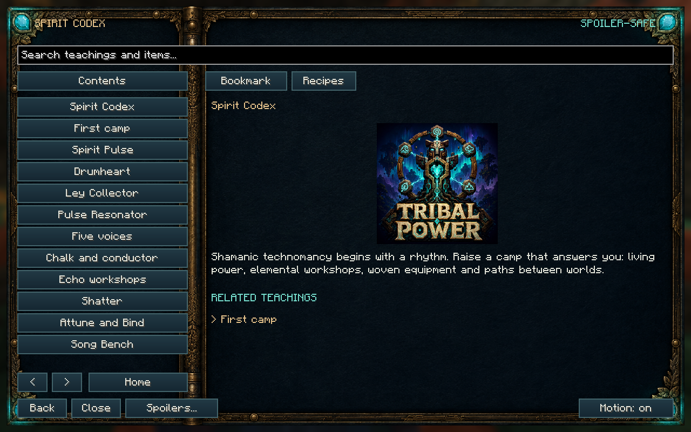

# Tribal Power — The Living Lattice


Shamanic technomancy for Minecraft Java 1.21.1, NeoForge 21.1.249. Version 4.0.1.

Build a camp that answers you: rhythmic power, elemental workshops, woven equipment, sustained rites, paths between worlds, and the Nine Tribes who once kept the Loom. Tribal Power works by itself and forms the Tribal Weave progression in Ninjacat Skies.

Authors: Ahmi & Risika Darrow. GNU GPL v3; see License.txt.

## Repository versions

`master` is the active Minecraft 1.21.1 / NeoForge version. The former rewrite branch has been incorporated into it.

- [Current 4.0.1 source](https://github.com/AhmiDarrow/Tribal-Power/tree/master)
- [Previous 4.0.0 source](https://github.com/AhmiDarrow/Tribal-Power/tree/v4.0.0)
- [Previous 3.8.0 source](https://github.com/AhmiDarrow/Tribal-Power/tree/v3.8.0)
- [Previous 3.7.1 source](https://github.com/AhmiDarrow/Tribal-Power/tree/v3.7.1)
- [Previous 3.7.0 source](https://github.com/AhmiDarrow/Tribal-Power/tree/v3.7.0)
- [Previous 3.6.2 source](https://github.com/AhmiDarrow/Tribal-Power/tree/v3.6.2)
- [Previous 3.6.0 source](https://github.com/AhmiDarrow/Tribal-Power/tree/v3.6.0)
- [Previous 3.5.0 source](https://github.com/AhmiDarrow/Tribal-Power/tree/v3.5.0)
- [Previous 3.4.2 source](https://github.com/AhmiDarrow/Tribal-Power/tree/v3.4.2)
- [Previous 3.4.1 source](https://github.com/AhmiDarrow/Tribal-Power/tree/v3.4.1)
- [Previous 3.4.0 source](https://github.com/AhmiDarrow/Tribal-Power/tree/v3.4.0)
- [Previous 3.3.3 source](https://github.com/AhmiDarrow/Tribal-Power/tree/v3.3.3)
- [Previous 3.3.2 source](https://github.com/AhmiDarrow/Tribal-Power/tree/v3.3.2)
- [Previous 3.3.1 source](https://github.com/AhmiDarrow/Tribal-Power/tree/v3.3.1)
- [Previous 3.3.0 source](https://github.com/AhmiDarrow/Tribal-Power/tree/v3.3.0)
- [Previous 3.2.2 source](https://github.com/AhmiDarrow/Tribal-Power/tree/v3.2.2)
- [Previous 3.2.1 source](https://github.com/AhmiDarrow/Tribal-Power/tree/v3.2.1)
- [Previous 3.2.0 source](https://github.com/AhmiDarrow/Tribal-Power/tree/v3.2.0)
- [Previous 3.1.0 source](https://github.com/AhmiDarrow/Tribal-Power/tree/v3.1.0)
- [Previous 3.0.0 source](https://github.com/AhmiDarrow/Tribal-Power/tree/v3.0.0)
- [Previous 2.3.0 source](https://github.com/AhmiDarrow/Tribal-Power/tree/v2.3.0)
- [Archived legacy 1.10.2 source](https://github.com/AhmiDarrow/Tribal-Power/tree/archive/legacy-1.10.2)
- [Archived previous master](https://github.com/AhmiDarrow/Tribal-Power/tree/archive/master-before-2.2.1)
- [Canonical CurseForge project](https://www.curseforge.com/minecraft/mc-mods/tribalpower) — project ID 1684851

Older code is preserved as archive tags rather than active development branches.

## Start a living workshop

Craft a Bone Chime, Spirit Shard and Drumheart. Strike the drum, then charge a Pulse Cell. Place an Earth Totem and Echo Shatter within eight blocks of a generator. Stone becomes Echo Shards; raw iron, gold and copper become two grits, each smeltable into an ingot.

Continue through Fire / Echo Attune, Water / Echo Bind, Spirit / Echo Manifest and Loom / Echo Unweave. Bound Echo becomes Manifested Ingot; manifest the ingot again for a Resonant Core. Water also binds wool into Spiritweave.

Each Echo station has a batch input, eight output slots, a progress screen and status readout. Faces default to feed on the sides and top, extract below; the IO pad in the UI changes that. Missing power, missing attunement or full output pauses the batch without consuming its input. The Song Bench empowers reagents and writes song sheets. It does not refine Echo.

The Spirit Codex provides the in-game guide. JEI, when installed, displays lattice recipes, attunements, duration and total Pulse cost before pack settings.

## Power with a place in the world

- **Drumheart:** deliberate beats about a second apart yield more Pulse. A redstone clock automates its rising-edge rhythm.
- **Ley Collector:** drinks the ley lines that pass through it. The lines are a web across every dimension, and up to six meet in the rarest places. It still takes a smaller gift from sky, night, rain, water, plants and animals. The land's share of a beat is capped at 6; the beat is still capped at 16.
- **Pulse Resonator:** seat an Echo catalyst and place distinct Resonance Totems within 8 blocks. Voices multiply, and the catalyst multiplies on top: six voices under a Resonant Core make 144 Pulse a second. The catalyst wears by the Pulse it has actually made, and crumbles when that life is spent. Echo Shard, Attuned Echo, Bound Echo and Resonant Core are the four tiers. Kinship Totems add extra tribe voices. A heap counts at most five voices total; six elements plus kinship need the Voice Ring at radius 3. Coal and wood are not fuel. Sneak empty-handed to lift what is left of the catalyst.
- **Pulse Cells:** ordinary cells hold 200 Pulse; Greater Cells hold 1,200.
- **Harmonic Energizer** (the Pulse Adapter block): 1 Pulse becomes 100 FE. Unranked it draws 60 Pulse a second, which is 300 FE a tick, and a rank 3 energizer reaches about 545 FE a tick. It stores 48,000 FE, exposes the standard energy capability, and cannot take FE back in. Redstone pauses it.
- **Lattice Converter:** FE back into Pulse, up to 40 a second. It starts at 220 FE a Pulse, and every distinct totem voice within 8 blocks knocks 20 off, down to a floor of 120. That floor sits above the Energizer's payout, so the two cannot close a loop that makes energy from nothing.

## Storage and automation

Ancestral Caches hold 54 slots locally. Deep Caches share a personal 54-slot vault, also accessible through a Wayfarer Satchel. Visiting The March attunes access; otherwise opening costs 5 Pulse. Spirit Cisterns hold 16,000 mB and expose standard fluid handlers. The **Spirit Flask** is a tank for the road at 4,000 mB, the **Greater Spirit Flask** at 16,000: use either on a tank, machine or fluid source to fill it, sneak-use to pour a bucket back out. Both are ordinary fluid containers, so pipes and other mods fill them in place.

Every inventory worth tidying carries a small **Tidy** button above its slots: your own pack, caches, and any chest, barrel, shulker box or hopper. It merges stacks and orders the rest, never touching the hotbar, armour or a machine's slots. Turn it off with `sortButtons` in the client config.

A Lattice Conductor does not make Pulse. Place conductors within 8 of each other and a machine within 8 of any of them draws generators, Pulse Cairns and totem buffers that line can reach. A redstone signal cuts that conductor out of the line. Ritual Chalk still joins two Resonance Totems (within 16): a Conductor within 8 of them and of a generator pulls up to 10 Pulse a second into those totem buffers (click for a 25-Pulse burst). Ranked conductors pull more. Dedicated Echo stations work with hoppers and item pipes. Cisterns and the FE adapter use standard capabilities.

Wireless relays are thin plates that snap onto a machine face. Seat the same item in two Bond slots to pair them, or mark a destination face with the Lattice Tuner and use it on the plate. A Water Seal rune moves fluid; an Earth Seal moves items. Sneak-click a plate to switch extract or insert.

Each Echo station and Ancestral Cache has a six-face IO pad. Sneak-use an empty hand on a face to cycle Input, Output, Both or Closed. Hoppers and pipes honour those faces.

1. **Local:** 32 blocks in the same dimension; 4 Pulse per successful transfer before pack settings.
2. **Longreach:** 128 blocks in the same dimension; 8 Pulse before pack settings.
3. **Astral:** unlimited distance, including other dimensions; 16 Pulse before pack settings.

Each beat transfers up to 16 items or 250 mB, once per second. Ranked plates move more cargo and spend more Pulse. Both endpoints must already be loaded. Relays never force-load remote chunks; an explicitly powered Wayanchor can sustain an endpoint. Full or unloaded destinations pause safely; pending fluid from a changing third-party receiver is retained.

## A camp that keeps working

- **Wayanchor:** sustains its own ticking chunk for 16 Pulse/s, with a 2,400-Pulse buffer and a limit of 32 active anchors per dimension. Redstone, removal or exhausted power releases its ticket.
- **Hush Totem:** prevents hostile spawning within 24 blocks for 8 Pulse/s. Existing mobs remain; commands and spawn eggs are exempt. Keep hostile summoning outside its ward.
- **Grove Tender:** place it yourself so it is claimed. It plants and harvests a 9-by-9 crop bed, at most one action per second. Planting costs 4 Pulse; harvest and replant costs 12; urging trees costs 16. With a Water Resonance Totem kept within eight blocks it also keeps every furrow of its bed wet (4 Pulse a beat, only when one has dried). Seeds enter the top row; outputs leave below. Full storage preserves crops, and player protection events apply.
- **Summoning Cradle:** use a Binding Effigy to harmlessly imprint one of 21 supported species. Awaken it at a Spirit-sealed Ritual Brazier with Earth, Air and Spirit voices, three Spiritweave and 200 Pulse. Each binding permits **512 successful summons**, then needs the ritual again. Every summon costs 80 Pulse and one Spiritweave; failed attempts consume nothing. The effigy preserves its count through saves and pickup. A comparator reads remaining binding strength. Eight nearby mobs pause summoning.
- **Spirit Lantern, Rain Chime and Offering Table:** carved, functional decorations providing full light, weather signals and 27-slot storage. The chime reports clear/rain/thunder as 0/8/15.

**Every automated hand answers to a voice:** a kept Resonance Totem of it within eight blocks, or the device stands idle and says which it wants. Earth for the Grove Tender and Wayanchor, Spirit for the Ward Drum, Hush Totem and Summoning Cradle, Water for the Tide Pump, Air for the Wind Snare and relays, Loom for the Seal Loom and Astral relays (`automationNeedsVoices` waives it). Redstone pauses every camp device and its inventory access. Farm, cradle and table expose standard item capabilities for hoppers, pipes and relays. With AgriCraft in the pack, the Grove Tender sets crop sticks, plants its seeds, rakes weeds, urges and harvests AgriCraft crops as its own, leaving the plant on its sticks; the five March crops are AgriCraft plants too, seeded from the plain crop, bred from two farm crops each, and at home on March ground under the sticks. All eight items have standalone recipes; Ninjacat Skies adds a connected camp quest branch and binding milestones.

## Paths for players

Sneak-use a compass on the top of a sturdy floor to bind it, then use it to travel. Leave two clear, dry blocks above the floor and avoid nearby hazards.

1. **Waystone Compass:** 128 blocks within one dimension; 20 Pulse.
2. **Horizon Compass:** any distance within one dimension; 40 Pulse.
3. **Astral Compass:** travel across dimensions; 100 Pulse.

Travel has a five-second cooldown. Redstone at the destination floor locks arrivals. The Gate Drum reaches The March, whose crystals unlock Astral transport for travellers and cargo.

## Equipment and rites

The **Sixfold Staff** switches voices with sneak-use: Earth slows hostiles, Fire strikes and ignites, Water heals and cleanses, Air grants a leap and slow falling, Spirit reveals enemies, and Loom tethers a foe toward you or, sneaking with no target, stitches you six blocks forward. Offensive rays stop at blocks. Each cast draws from carried cells.

The **Resonance Maul** excavates a deliberate 3-by-3 plane when sneak-used in the main hand, costing 8 Pulse per broken block. Normal player breaking checks and protection events still apply.

**Spiritweave armor** unlinked: hood night sight, robe resistance, leggings speed, boots slow falling when descending. Unlinked pieces spend 2 Pulse every four seconds; sneak-use a piece on a Resonance Totem (40 Pulse) to replace that boon with the totem's voice (3 Pulse). Mixed voices are intended. Original Spiritgear tools remain available.

**Spiritgear Shears** and a **Spiritgear Hoe** join the set and rank and bind the same way. The shears take a 3x3 face of foliage with Earth, trim for nothing with Air, leave a sheep its fleece with Water, smoke a hive calm with Fire, mend what they shear with Spirit and send cuttings to hand with Loom. The hoe reaps and sows a ripe crop in one use: Earth turns a 3x3 of soil, Water keeps its furrows and nearby fields wet, Air reaps a 3x3, Loom a 5x5 for no Pulse, and Spirit doubles part of the harvest.

The **Totem Wrench** turns a block without breaking it, and sneak-used on a machine face steps that face through Both, Input, Output and Closed for 1 Pulse. The **Weaver's Wand** carries the face you click across every matching neighbour, up to 32 blocks, spending blocks from your pack and 2 Pulse each.

Seat a reusable seal in a **Ritual Brazier** with its matching totem nearby. Earth grants haste, Fire resists flame, Water regenerates, Air slows falls, Spirit grants night sight, and Loom threads 2 Pulse into carried cells every two seconds with Luck. A six-block blessing consumes 8 Pulse every two seconds while players are present. Sneak empty-handed to recover the seal.

## Redstone language

High signal pauses generators other than the Drumheart, workshops, conductors, relays and braziers. It locks cache access, cistern filling/draining, FE extraction and travel destinations. Capability references cached by other mods also obey the live signal. The Drumheart deliberately responds to rising edges instead.

Comparators read stored resources. Relay output is 0 unlinked, 1 linked but waiting or paused, and 15 while transferring. Stored resources and unfinished work survive a pause.

## Datapack recipes

Recipes live under data/<namespace>/recipe/ and use the normal server recipe manager and client synchronization. Example:

```json
{
  "type": "tribalpower:lattice",
  "station": "echo_shatter",
  "ingredient": {"tag": "c:raw_materials/iron"},
  "result": {"id": "tribalpower:iron_grit", "count": 2},
  "attunement": "earth",
  "seconds": 4,
  "pulse_per_second": 20
}
```

Use a standard ingredient, including compatible mod ingredients. Station names are echo_shatter, echo_attune, echo_bind, echo_manifest, echo_unweave and ember_kiln. KubeJS can register this JSON with event.custom. Pack-specific recipes belong in the pack; standalone recipes never require Ninjacat Skies.

## The Nine Tribes

Nine tribes kept the Loom of Worlds, one Strand each, until the Cut scattered them. Their camps still stand: Pad-keepers (plains), Grit-singers (mountains), Rootbinders (forests), Edge-walkers (taiga), Drumhearts (savanna), Pattern-weavers (birch), Colony-keepers (flower meadows), Seal-carvers (dark forests) and Loom-stitchers (the March crystal fields only). Every tribe also keeps a March camp. Each camp holds four **Tribal Kin**: an Elder who trades, a Drummer whose beat feeds 2 Pulse into a Drumheart, Ley Collector or Pulse Resonator within eight blocks, a Hunter who strikes hostiles within twelve blocks, and a Weaver who returns to the loom in their hut every minute or so to work it. Kin never despawn and wander within sixteen blocks of their camp.

- **Standing:** right-click a **Tribe Hearth** with a favoured item (+3), the tribe's reagent (+8), any food (+1) or a charged Pulse Cell (+2 per 10 Pulse, up to 40 drained). Hostile kills within 24 blocks of a hearth give +1 (twenty per day per tribe); a completed trade gives +2. Hurting Kin costs 25 and turns the Hunters on you for a minute; breaking a tribe banner costs 5, the hearth 40. Generic camp blocks do not cost standing. Ranks: Guest 50, Friend 150, Kin 400, Voice 800. `/tribalpower standing [player]` prints all nine. A comparator on the hearth reads the last visitor's rank.
- **Trades:** Elders open a merchant screen with two offers per rank (Guest, Friend, Kin), paid in the tribe's favoured items and Echo tiers. At Voice the Elder gives a **Tribe Mark** once. Camp members trade at the camp's standing when it beats their own.
- **Tribe Banners** decorate camps in the tribe colour and glyph.
- **Kinship Totem:** a Tribe Mark, the Resonance Totem of the tribe's voice and two Spiritweave. It lends that voice to nearby stations and counts as an extra distinct voice for the Pulse Resonator, tracked per tribe, so nine tribes beside six totems make fifteen voices.

## The March remembers

- **Ancestor Halls** (March steppe and highlands): sunken three-room halls with four **Lore Tablets** on the walls, two loot chests (Loom Thread, echoes, Spiritweave, seals) and Hollow Sentinels in the side rooms. Right-click a tablet to read it; each of the twelve tablets becomes a Codex entry once read (the Spirit Codex shows tablet pages and tribe crest pages you have earned without the spoiler veil; the Voice-rank Tribe Mark unlocks a tribe's page).
- **Drum Circle** (March highlands): twelve pillars around a **Silent Drum**. Strike the drum empty-handed or with a Bone Chime; four beats 16 to 28 ticks apart wake **The Unsung**, once per twenty minutes of real time per drum, and only when the drum stands on its altar (polished deepslate under it, a candle at each of the four corners). A drum without that altar keeps the rhythm and does not call anything.
- **The Unsung:** a hollow drum-spirit, 400 health, armour 8, with a boss bar. Beat phase: a shockwave every three seconds deals 6 to unbraced players within eight blocks (sneak to brace for half and no knockback); swipes deal 10. Chorus (below two thirds): two Echo Weavers every eight seconds, up to six, shockwaves every 2.5 seconds. Silence (below one third): invulnerable over the drum, casting slow weaving bolts; strike the four-beat on the Silent Drum to stun it for eight seconds at double damage. Drops an Unsung Heart, 16 to 24 Loom Thread and 4 Resonant Cores; resets after thirty seconds with no player within 48 blocks.
- **Crystal Spire** (crystal fields): a March Crystal spire with the Loom-stitchers' waystation at its foot, their only camp.

## The sixth voice

**Loom** joins Earth, Fire, Water, Air and Spirit. **Loom Thread** comes from Ancestor Hall chests, The Unsung and Loom-stitcher trades at Friend rank. An **Unsung Heart**, two Loom Thread, four March Crystal and two March Planks make the **Resonance Totem (Loom)**, a distinct voice for the Resonator.

- **Echo Unweave** (sixth Echo station, Loom): Manifested Ingot → 2 Bound Echo, Bound Echo → 2 Attuned Echo, Attuned Echo → 2 Echo Shards, Spiritweave → 2 Wool, Resonant Core → 3 Manifested Ingots, and worn Spiritgear (any tool in `#tribalpower:spiritgear_tools` with durability damage; the `tribalpower:damaged` ingredient type) → 1 Manifested Ingot. Datapacks use `"station": "echo_unweave"`.
- **Loom Seal** (Blank Seal, Loom Thread, Spirit Shard): in a Ritual Brazier the *Tension* blessing refills 2 Pulse into carried cells every two seconds and grants Luck.
- **Sixfold Staff:** the item id stays `spirit_staff`. Loom mode *Tether* pulls the target up to eight blocks toward you for 6 Pulse; sneak-cast with no target, *Stitch* blinks you six blocks forward for 10.

## World rites

Craft a **Rite Tablet** from two stone, a creature reagent and the matching seal; the seal is returned. Sneak-use the tablet on a Ritual Brazier holding that seal. The brazier draws the cost from the lattice within eight blocks; if there is not enough, nothing is consumed.

| Rite | Seal | Pulse | Effect |
|---|---|---|---|
| Rain Calling | Water | 400 | rain for 20 minutes |
| Sky Clearing | Air | 400 | clear weather for 40 minutes |
| Green Blessing | Earth | 600 | 3-by-3 chunks get 3 extra random ticks per second for 20 minutes |
| Still Night | Spirit | 600 | no hostile spawns within 64 blocks for 15 minutes |
| Dawn Calling | Fire | 800 | time advances to sunrise (game rule `tribalpower:allowDawnRite`, default true) |
| Ley Binding | Loom | 1,200 | a 30-minute ley line joins the nearest two totems within 64 blocks; Conductors route Pulse across it |

Seal-carvers sell the Still Night tablet at Friend rank (three Attuned Echo and two Spirit Shards).

## Bound spirits

A **Bonding Charm** (two Spiritweave, a Spirit Shard and Lantern Down, Mossback Scale or Dawn Velvet) bonds an adult Lantern Fox, Mossback or Dawn Stag with a 60% chance per use; a failed charm is kept. Bonded animals follow within three to ten blocks, teleport past twelve, never despawn, ignore their owner's blows and yield double when brushed. Sneak-use toggles stay and follow. Wild adults roll Frame, Stride, Fang, Hum and Keep (0–3) plus named Marks; sneak-use a Ley Lens to read them. The charm does not reroll. Breed two of the same species for better threads.

- **Lantern Fox:** Night Vision for the owner within eight blocks, glints on ores within six blocks of the fox every four seconds, and a moving Spirit Light (light level 10, 12 with Glow-vein).
- **Mossback:** a nine-slot saddlebag (sneak-use with an empty hand); twelve with Deep Pocket; dropped on death.
- **Dawn Stag:** rideable without a saddle by its owner; hold jump for a short leap (higher with Leap).

## Camps

`/tribalpower camp create <name>`, `invite <player>`, `join <name>`, `leave`, `kick <player>`, `info` and `rename <name>`. A **Camp Charter** (paper, Spiritweave, Spirit Shard) invites the player it is used on. Invitations last five minutes. Members share one 54-slot camp vault from any Deep Cache or Wayfarer Satchel (sneak-use switches back to the personal vault), count as owners of each other's camp devices, share a budget of twelve Wayanchors instead of thirty-two per dimension, and mirror a quarter of their tribe standing to the camp.

## Ley Sight and Pulse logic

- **Ley Lens** (glass pane, Copper Resonator, Spirit Shard): held in either hand, use cycles ley sight, the Pulse zone, voices, machines, and off. Ley sight draws each nearby vein as one flowing thread in a Resonance Totem's colour — earth, fire, water, air, spirit, or loom — with a bright node of that colour along it, and the HUD reads the collector's beat. The land's share of a beat is capped at 6, and each line touching the collector adds 2. Craft the lens into a Spiritweave Hood for ley goggles; sneak-use the hood to turn those off. Sneak-use the lens on a Ley Collector for its exact factor breakdown, or on a lattice animal for its threads and Marks. Open sky counts 1 by day and 3 by night; rain adds 2; water and greenery add 4 each.
- **Pulse Gauge:** points at any Pulse holder and emits redstone 0 to 15 in proportion to its charge, refreshed every four ticks; a comparator reads the same.
- **Pulse Threshold:** emits a full signal while the faced holder is at or above 25, 50, 75 or 100%. Right-click cycles; a comparator reads 1 to 4.

## Codex diagnostics

Sneak-use the Spirit Codex on any Tribal block: stored Pulse, every generator within eight blocks with its output this second, attunements present, drawable Pulse and redstone state. Workshops name their recipe and any missing voice or full output; relays report unloaded or locked endpoints; braziers list the rites their seal allows. Blocks implement `Diagnosable`; others get a default report.

## The March, 4.x

The 4.x releases give the March a life of its own. Tribe **Elders talk**: conversations, daily requests, a seven-step story per tribe ending at a **guardian trial**, and a relic for each. Eight **guardians** keep the eight March countries, called from altars at their grounds; The Unsung keeps the ninth trial, and the **Ninth Agreement** rite closes the story for anyone carrying all nine relics. The March has **weather** of its own, **ley surges**, tribe **festival days** and **wandering spirits**, and its own music. Its history is carved into **Carved Stones** and **Murals** that the Codex's **Chronicle** assembles, and the Codex's *Where to go next* page keeps one concrete **next step** in view.

## Pack-maker configuration

Everything with a number is in `config/tribalpower-common.toml`, by section:

| Section | What it holds |
|---|---|
| `balance`, `world`, `march` | Pulse economy, generation, March spawn and threat numbers, sleep rules |
| `weapons`, `anointing`, `healing`, `kit`, `effects`, `cuisine` | Weapon stats, anointment powers, remedies, kit tiers, blessings and boons, dishes and feasts |
| `quests` | Request rewards, requests per Tribe Mark, whether Elders talk at all (`elderDialogue`) |
| `camp` | Whether the automated hands need their voices' totems (`automationNeedsVoices`), the Grove Tender's watering cost |
| `guardians` | `guardiansEnabled`, health and damage scales, the call's cost, altar rest, attack and wave timings, add caps, the Ninth Agreement's cost and boon |
| `events` | Each event family on or off (weather, surges, festivals, wandering spirits), their timing, yields and rewards, and the warning before a weather or surge sets in (`eventWarningSeconds`) |

Datapacks can replace or add:

- **Elder dialogue**: `data/tribalpower/dialogue/<tribe>/*.json` (roots with conditions, nodes with choices, actions); texts are lang keys. Files for one tribe merge.
- **Hearth Pot meals**: `data/tribalpower/recipe/hearth/*.json` (`tribalpower:hearth`, up to four ingredients and an optional container).
- **Echo station and kiln recipes**: `tribalpower:lattice` (above).
- **Structure spacing and biomes**: `worldgen/structure_set/<name>.json` and `tags/worldgen/biome/has_structure/<name>.json`, including the guardian grounds (`slag_throne`, `drowned_root`, `cairn_ring`, `singing_fracture`, `sealed_gate`, `tide_stone`, `trampled_ring`, `roost`).
- **Spawn weights**: the `spawners` block of each `worldgen/biome/march_*.json`; biome music in its `effects.music`.
- **Paintings and crests**: `painting_variant/*.json` with the `minecraft:placeable` tag, and `banner_pattern/*.json` with the `tribalpower:pattern_item/<tribe>` tags.
- **Codex pages**: `assets/tribalpower/codex/en_us/` (a resource pack), one JSON per entry.

The client config (`tribalpower-client.toml`) holds the aurora and the Tidy buttons.

## Development

Java 21. `gradlew build` produces the jar; `gradlew runVerification` runs the server GameTests. Art and generator scripts stay in the local checkout and are not part of this repository.

Existing block/item IDs and storage slots remain stable. An old Resonator retains unused coal for retrieval but no longer burns it. Existing caches expand to 54 slots. 3.0 adds content only; 2.x worlds load unchanged and new structures appear in newly generated chunks.

## The Returning Song

Three breedable animals and ten hostile creatures populate Overworld forests/swamps and the March; 3.0 adds the Tribal Kin and The Unsung. Brush adult Dawn Stags, Lantern Foxes and Mossbacks for renewable resources. Recover guardian reagents for native Echo recipes. The Spirit Codex explains habitats, food, harvesting and combat; Ninjacat Skies adds the corresponding story branch.

Night skies carry an animated aurora and nine small constellations. The March has its own twilight and fog palette. Client settings control brightness, detail and dimension coverage; disable the effect when using a shader pack with a custom sky.

## Illustrated Spirit Codex

Use the Spirit Codex item for an interactive native wiki: searchable teachings (210, with nine tribe crests, the March structures, the twelve Lore Tablets and walkthroughs), a picture on every 3.0 page (thirteen creature portraits plus the Kin, The Unsung and the bonded familiars, and Blender vignettes of the real block models for the structures, rites, camps, ley sight, Pulse logic and diagnostics), a per-system animated diagram on every page (tribe offerings, the Unsung's four-beat and boss bar, Echo Unweave running the lattice backwards, the six rites' effects, familiar tricks, the ley grid, the Pulse Gauge driving a lamp), bookmarks, related-page links, and crafting/Echo recipe and use cards from the current world. No other mod is required; JEI is optional. Advanced discoveries and the full recipe graph require an explicit spoiler choice per reading session. Pictures on spoiler-free pages are limited to the page's own item. Hide spoilers returns to the safe landing page. Motion toggles animation; scroll or use Page Up / Page Down to read longer pages.


