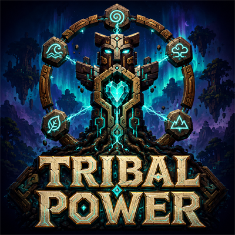

# Tribal Power — The Living Lattice



Shamanic technomancy for Minecraft Java 1.21.1, NeoForge 21.1.249. Version 2.2.1.

Build a camp that answers you: rhythmic power, elemental workshops, woven equipment, sustained rites and paths between worlds. Tribal Power works by itself and forms the Tribal Weave progression in Ninjacat Skies.

Authors: Ahmi & Risika Darrow. GNU GPL v3; see License.txt.

## Repository versions

`master` is the active Minecraft 1.21.1 / NeoForge version. The former rewrite branch has been incorporated into it.

- [Current 2.2.1 source](https://github.com/AhmiDarrow/Tribal-Power/tree/v2.2.1)
- [Archived legacy 1.10.2 source](https://github.com/AhmiDarrow/Tribal-Power/tree/archive/legacy-1.10.2)
- [Archived previous master](https://github.com/AhmiDarrow/Tribal-Power/tree/archive/master-before-2.2.1)
- [Canonical CurseForge project](https://www.curseforge.com/minecraft/mc-mods/tribalpower) — project ID 1684851

Older code is preserved as archive tags rather than active development branches.

## Start a living workshop

Craft a Bone Chime, Spirit Shard and Drumheart. Strike the drum, then charge a Pulse Cell. Place an Earth Totem and Echo Shatter within eight blocks of a generator. Stone becomes Echo Shards; raw iron, gold and copper become two grits, each smeltable into an ingot.

Continue through Fire / Echo Attune, Water / Echo Bind, and Spirit / Echo Manifest. Bound Echo becomes Manifested Ingot; manifest the ingot again for a Resonant Core. Water also binds wool into Spiritweave.

Each Echo station has a batch input, eight output slots, a progress screen and status readout. Feed above or from the sides; extract below. Missing power, missing attunement or full output pauses the batch without consuming its input. The original single-item Song Bench remains available.

The Spirit Codex provides the in-game guide. JEI, when installed, displays lattice recipes, attunements, duration and total Pulse cost.

## Power with a place in the world

- **Drumheart:** deliberate beats about a second apart yield more Pulse. A redstone clock automates its rising-edge rhythm.
- **Ley Collector:** sky, night, rain, nearby water and living greenery influence collection.
- **Pulse Resonator:** a reusable Echo catalyst and at least two distinct nearby totem voices produce Pulse. Echo Shard, Attuned Echo, Bound Echo and Resonant Core are increasing catalyst ranks. More distinct voices improve output. Coal and wood are not fuel.
- **Pulse Cells:** ordinary cells hold 200 Pulse; Greater Cells hold 1,200.
- **Pulse Adapter:** one-way conversion of 1 Pulse into 100 FE, at up to 20 Pulse per second. Stores 16,000 FE and exposes the standard NeoForge energy capability. FE cannot feed back into Pulse.

## Storage and automation

Ancestral Caches hold 54 slots locally. Deep Caches share a personal 54-slot vault, also accessible through a Wayfarer Satchel. Visiting The March attunes access; otherwise opening costs 5 Pulse. Spirit Cisterns hold 16,000 mB and expose standard fluid handlers.

A Lattice Conductor moves Pulse through chalk-linked totems and routes Song Bench items through nearby Ancestral Caches. Delivered feed starts the bench automatically. Charged totems keep item routing active even when their buffers are full. Dedicated Echo stations work with hoppers and item pipes. Cisterns and the FE adapter use standard capabilities.

Wireless relays pull from the inventory or tank below them. Mark a receiving block face with the Lattice Tuner, then use it on the relay. Sneak-use the tuner to replace its mark.

1. **Local:** 32 blocks in the same dimension; 4 Pulse per successful transfer.
2. **Longreach:** 128 blocks in the same dimension; 8 Pulse.
3. **Astral:** unlimited distance, including other dimensions; 16 Pulse.

Each beat transfers up to 16 items or 250 mB, once per second. Both endpoints must already be loaded. Automation never force-loads remote chunks. Full or unloaded destinations pause safely; pending fluid from a changing third-party receiver is retained.

## Paths for players

Sneak-use a compass on the top of a sturdy floor to bind it, then use it to travel. Leave two clear, dry blocks above the floor and avoid nearby hazards.

1. **Waystone Compass:** 128 blocks within one dimension; 20 Pulse.
2. **Horizon Compass:** any distance within one dimension; 40 Pulse.
3. **Astral Compass:** travel across dimensions; 100 Pulse.

Travel has a five-second cooldown. Redstone at the destination floor locks arrivals. The Gate Drum reaches The March, whose crystals unlock Astral transport for travellers and cargo.

## Equipment and rites

The **Fivefold Staff** switches voices with sneak-use: Earth slows hostiles, Fire strikes and ignites, Water heals and cleanses, Air grants a leap and slow falling, and Spirit reveals enemies. Offensive rays stop at blocks. Each cast draws from carried cells.

The **Resonance Maul** excavates a deliberate 3-by-3 plane when sneak-used in the main hand, costing 8 Pulse per broken block. Normal player breaking checks and protection events still apply.

**Spiritweave armor** provides night sight, resistance, speed and conditional slow falling. Each active piece consumes 2 Pulse every four seconds. Original Spiritgear tools remain available.

Seat a reusable seal in a **Ritual Brazier** with its matching totem nearby. Earth grants haste, Fire resists flame, Water regenerates, Air slows falls, and Spirit grants night sight. A six-block blessing consumes 8 Pulse every two seconds while players are present. Sneak empty-handed to recover the seal.

## Redstone language

High signal pauses generators other than the Drumheart, workshops, conductors, relays and braziers. It locks cache access, cistern filling/draining, FE extraction and travel destinations. Capability references cached by other mods also obey the live signal. The Drumheart deliberately responds to rising edges instead.

Comparators read stored resources. Relay output is 0 unlinked, 1 linked but waiting or paused, and 15 while transferring. Stored resources and unfinished work survive a pause.

## Datapack recipes

Recipes live under data/<namespace>/recipe/ and use the normal server recipe manager and client synchronization. Example:

```json
{
  "type": "tribalpower:lattice",
  "station": "echo_shatter",
  "ingredient": {"tag": "c:raw_materials/iron"},
  "result": {"id": "tribalpower:iron_grit", "count": 2},
  "attunement": "earth",
  "seconds": 4,
  "pulse_per_second": 10
}
```

Use a standard ingredient, including compatible mod ingredients. Station names are echo_shatter, echo_attune, echo_bind and echo_manifest. KubeJS can register this JSON with event.custom. Pack-specific recipes belong in the pack; standalone recipes never require Ninjacat Skies.

## Development

Java 21. Run gradlew build to build the jar and gradlew runVerification for server GameTests. The pack verification runs use disposable directories under build/.

Regenerate content with python tools/expand_content.py, the guide with python tools/generate_guide.py, and authored pixel assets/models with python tools/overhaul_art.py. Art uses 32-pixel textures, native models and bounded particles; no shaders are required.

Existing block/item IDs and storage slots remain stable. An old Resonator retains unused coal for retrieval but no longer burns it. Existing caches expand to 54 slots.

## The Returning Song

Three breedable animals and ten new hostile creatures populate Overworld forests/swamps and the March. Brush adult Dawn Stags, Lantern Foxes and Mossbacks for renewable resources. Recover guardian reagents for native Echo recipes. The Spirit Codex explains habitats, food, harvesting and combat; Ninjacat Skies adds the corresponding story branch.

Night skies carry an animated aurora and nine small constellations. The March has its own twilight and fog palette. Client settings control brightness, detail and dimension coverage; disable the effect when using a shader pack with a custom sky.

Editable Blender models, animations and previews are in `art/creatures/`. See [bestiary and sky documentation](docs/bestiary-and-skies.md) for authoring and validation.
